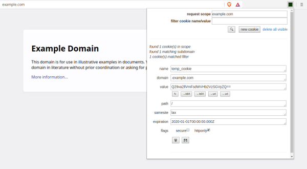

# Abra o Editor de Cookies

## Um editor de cookies chromium em que você pode confiar
Não confio em muitas extensões que podem ler/gravar dados confidenciais do navegador, então decidi escrever o meu próprio e abrir o código. A base de código é intencionalmente pequena, oferecendo um editor de cookies minimalista que pode ter o código-fonte revisado em alguns minutos.

## Alguns (espero) recursos úteis
- editar/excluir todos os aspectos dos cookies existentes
- criar novos cookies
- ajudantes de codificação/decodificação de base64 e url
- pesquisa+filtro inteligente dentro do escopo do domínio

## Obtenha-o na loja de extensões (ou apenas instale você mesmo)
Se você é extremamente paranóico com ataques à cadeia de suprimentos, revise o código aqui, clone e instale como uma extensão descompactada localmente

